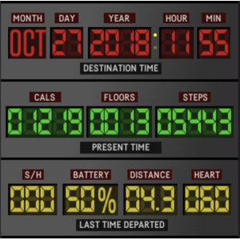

Oh là là?! ... a Time Machine?!

almost ;)

Monitor your PRESENT the bttf-style.

To be continued...
_________________
Display-fields:

-> first Panel
- Month
- Day
- Year
- Hour
- Minutes (AM / PM can not be indicated yet)

-> second Panel
- Calories
- Floors
- Steps

-> third Panel
- Steps this hour
- Battery Level (in %)
- Distance (assumes metric system)
- current Heartbeats per Minute (updates from sensor while display is on)
________________
The clockface is currently in the review-process at fitbit.
Once it is clreared it will be available completely free of charge.
If you would like to try it out already you could use this link: https://gam.fitbit.com/gallery/clock/d6e1a1e6-5b86-4e83-b806-c928c7b75f61
(needs to be clicked from a mobile device, because it redirects to the fitbit app)
